# Visible Image Gallery

Generated from public rendered pages. Repeated carousel items are shown once.

| Preview | Source | Type | Used on | Alt text | File size |
| --- | --- | --- | --- | --- | ---: |
|  | `/company/hypehub.png` | inline | `/` | Hype Hub | 14.9 KB |
|  | `/company/SGCupid.png` | inline | `/bio` | SGCupid | 5.4 MB |
|  | `/company/SGDaily.png` | inline | `/bio`, `/` | SGDaily | 4.8 MB |
|  | `/company/SGHomez.png` | inline | `/bio`, `/` | SGHomez | 4.7 MB |
|  | `/company/ViralAsia.png` | inline | `/bio`, `/blog/container-cafes-in-johor-bahru`, `/blog/image-testing-page`, `/blog`, `/blog/savoring-the-best-pork-trotter-in-chinatown-singapore`, `/blog/sgd19-lok-lok-buffet-in-singapore-the-ultimate-late-night-feast` | ViralAsia Logo | 19.9 KB |
|  | `/images/ad_posting.png` | background | `/` | (empty) | 1.6 MB |
| 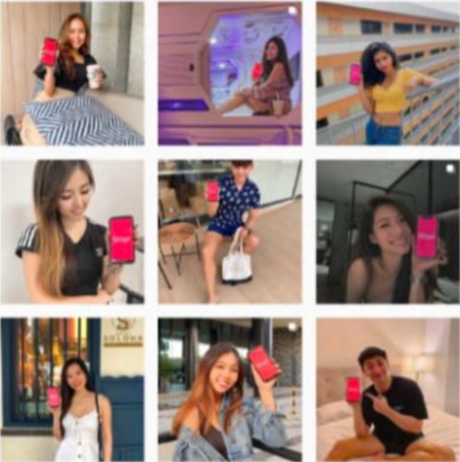 | `/images/influencer.png` | background | `/` | (empty) | 1.7 MB |
| 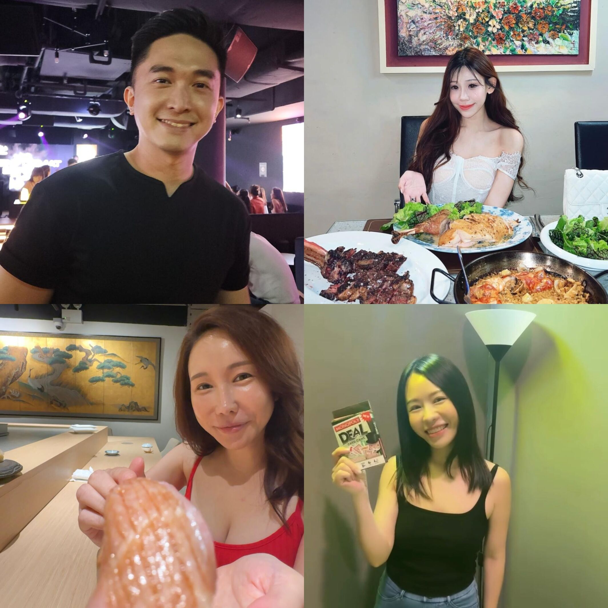 | `/images/models.jpg` | background | `/` | (empty) | 403.7 KB |
|  | `/images/moving.gif` | background | `/blog/container-cafes-in-johor-bahru`, `/blog/image-testing-page`, `/blog`, `/blog/savoring-the-best-pork-trotter-in-chinatown-singapore`, `/blog/sgd19-lok-lok-buffet-in-singapore-the-ultimate-late-night-feast`, `/` | (empty) | 225.2 KB |
|  | `/images/professional_team.jpg` | background | `/blog/container-cafes-in-johor-bahru`, `/blog/image-testing-page`, `/blog`, `/blog/savoring-the-best-pork-trotter-in-chinatown-singapore`, `/blog/sgd19-lok-lok-buffet-in-singapore-the-ultimate-late-night-feast`, `/` | (empty) | 299.5 KB |
| 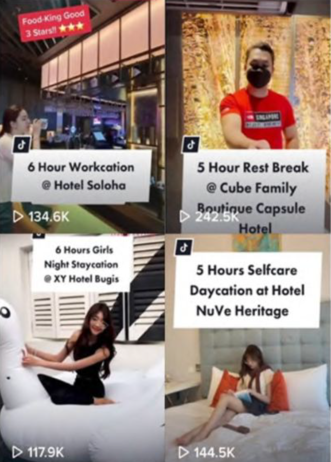 | `/images/smm.png` | background | `/` | (empty) | 1.3 MB |
| 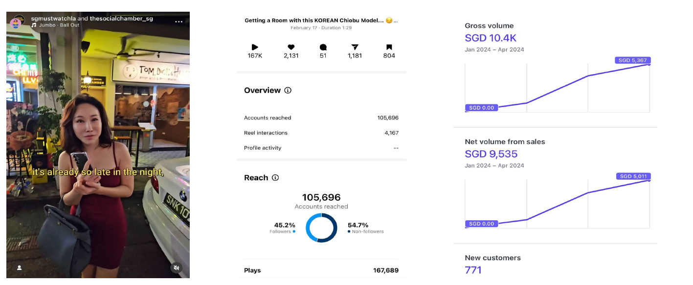 | `/images/socialchamber.png` | inline | `/` | Testimonial | 632.5 KB |
| 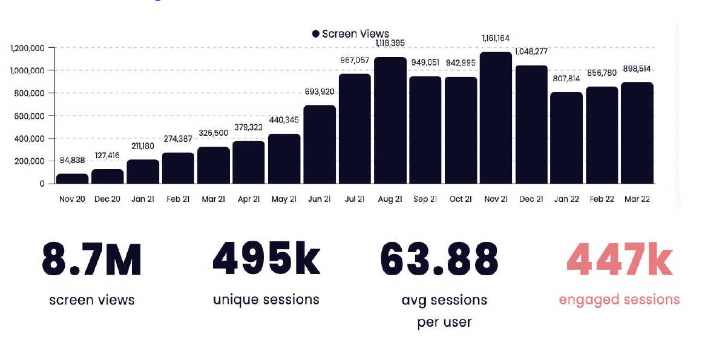 | `/images/stayr.png` | inline | `/` | Testimonial | 264.9 KB |
| 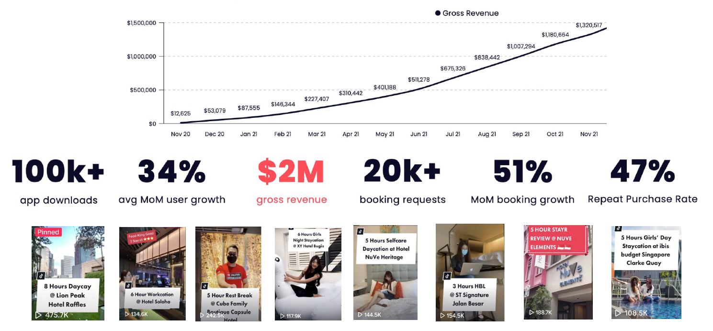 | `/images/stayr2.png` | inline | `/` | Testimonial | 847.1 KB |
| 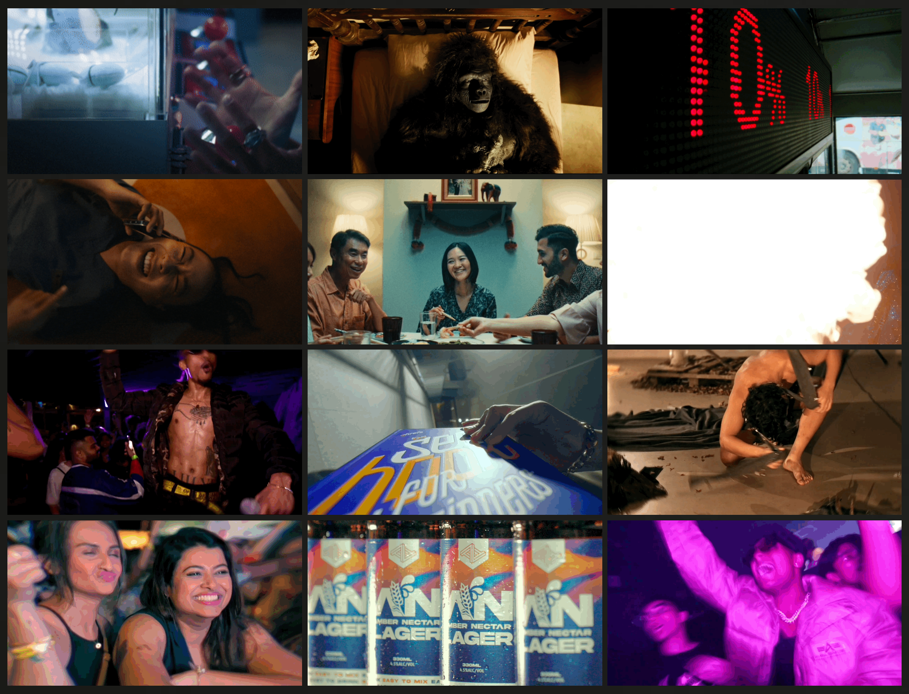 | `/images/tahsh.png` | background | `/` | (empty) | 3.1 MB |
|  | `/images/tiktok-logo.gif` | inline | `/` | TikTok Logo | 577.9 KB |
|  | `/logos/1. The Social Chamber.png` | inline | `/` | Travis Tay Logo | 696.0 KB |
|  | `/logos/12. Nurture Studio.jpg` | inline | `/` | Tianze Zhao Logo | 19.3 KB |
|  | `/logos/16. Grow Public Relations.png` | inline | `/` | Christel Goh Logo | 15.9 KB |
|  | `/logos/17. Jigsawstack.jpg` | inline | `/` | Yoeven D. Khemlani Logo | 22.7 KB |
|  | `/logos/3. 87 Just Thai.jpg` | inline | `/` | Eric Tan Logo | 116.0 KB |
|  | `/logos/9. Shebella.jpeg` | inline | `/` | Shebella Beauty Logo | 9.8 KB |
|  | `/logos/Ah Gong KKM.jpg` | inline | `/` | {{text}} | 8.8 KB |
|  | `/logos/Babies Bliss.jpeg` | inline | `/` | {{text}} | 7.1 KB |
|  | `/logos/Bachi Bachi Restaurant.jpeg` | inline | `/` | {{text}} | 5.9 KB |
|  | `/logos/baofachachaanteng 1.jpeg` | inline | `/` | {{text}} | 8.5 KB |
|  | `/logos/Basil King 1.jpeg` | inline | `/` | {{text}} | 6.1 KB |
|  | `/logos/Cheeky Signatures Restaurant.jpeg` | inline | `/` | {{text}} | 9.8 KB |
|  | `/logos/Creamie Sippies.png.webp` | inline | `/` | {{text}} | 45.3 KB |
|  | `/logos/crosscoop.png` | inline | `/` | {{text}} | 18.7 KB |
|  | `/logos/distrii.png` | inline | `/` | {{text}} | 12.6 KB |
|  | `/logos/DMC Karting.png` | inline | `/` | {{text}} | 2.5 KB |
|  | `/logos/Dong Smokes.png` | inline | `/` | {{text}} | 5.3 KB |
|  | `/logos/Evan_s Kitchen.jpeg` | inline | `/` | {{text}} | 36.2 KB |
|  | `/logos/Fat Fish Restaurant.jpeg` | inline | `/` | {{text}} | 7.1 KB |
|  | `/logos/Fook Kin Restaurant.png` | inline | `/` | {{text}} | 55.0 KB |
|  | `/logos/furama.png` | inline | `/` | {{text}} | 6.5 KB |
|  | `/logos/hotelg.png` | inline | `/` | {{text}} | 9.4 KB |
|  | `/logos/Huang Lao Dou.jpeg` | inline | `/` | {{text}} | 11.6 KB |
|  | `/logos/ibis.png` | inline | `/` | {{text}} | 128.2 KB |
|  | `/logos/iDrink.png` | inline | `/` | {{text}} | 4.1 KB |
|  | `/logos/Joomak Restaurant.png` | inline | `/` | {{text}} | 2.0 KB |
|  | `/logos/Just Thai 1.jpeg` | inline | `/` | {{text}} | 79.0 KB |
|  | `/logos/JWC Cafe.png` | inline | `/` | {{text}} | 11.1 KB |
|  | `/logos/Jyu Yae Bistro.jpeg` | inline | `/` | {{text}} | 6.7 KB |
|  | `/logos/Keebs Project.jpeg` | inline | `/` | {{text}} | 4.5 KB |
|  | `/logos/Kimrobinson.jpg` | inline | `/` | {{text}} | 25.9 KB |
|  | `/logos/klook.png` | inline | `/` | {{text}} | 28.8 KB |
|  | `/logos/Laifaba Restaurant 1.jpeg` | inline | `/` | {{text}} | 6.8 KB |
|  | `/logos/LFG Content Co.png.webp` | inline | `/` | {{text}} | 32.7 KB |
|  | `/logos/Longjing Restaurant.jpeg` | inline | `/` | {{text}} | 731.0 KB |
|  | `/logos/Maxi Home 1.jpeg` | inline | `/` | {{text}} | 7.3 KB |
|  | `/logos/Meet 4 Meat.jpg` | inline | `/` | {{text}} | 46.2 KB |
|  | `/logos/Mega Furniture.webp` | inline | `/` | {{text}} | 21.8 KB |
|  | `/logos/Micasa Kitchen & Bar 1.webp.png` | inline | `/` | {{text}} | 29.7 KB |
|  | `/logos/Mode Aesthetics 1.jpg.avif` | inline | `/` | {{text}} | 5.1 KB |
|  | `/logos/mox.png` | inline | `/` | {{text}} | 251.5 KB |
|  | `/logos/Nan Yang Dao 1.png` | inline | `/` | {{text}} | 116.4 KB |
|  | `/logos/Nana Dolly Cafe.jpeg` | inline | `/` | {{text}} | 4.4 KB |
|  | `/logos/OH!SOME 1.jpeg` | inline | `/` | {{text}} | 27.6 KB |
|  | `/logos/Ola Home.jpeg` | inline | `/` | {{text}} | 10.1 KB |
|  | `/logos/Oriental Food Restaurant.png` | inline | `/` | {{text}} | 9.6 KB |
|  | `/logos/oriential_food.jpg` | inline | `/` | {{text}} | 235.5 KB |
|  | `/logos/Origanics SG.png` | inline | `/` | {{text}} | 4.7 KB |
|  | `/logos/Owen_s Restaurant.jpg` | inline | `/` | {{text}} | 24.1 KB |
|  | `/logos/Pacific Kopi.jpeg` | inline | `/` | {{text}} | 4.0 KB |
|  | `/logos/Padi Kopitiam.png` | inline | `/` | {{text}} | 8.0 KB |
|  | `/logos/Palates & Bagels.png` | inline | `/` | {{text}} | 1.9 KB |
|  | `/logos/Pancakes & Friends Cafe.png` | inline | `/` | {{text}} | 3.1 KB |
|  | `/logos/Porcelain Hotel 1.png` | inline | `/` | {{text}} | 2.9 KB |
|  | `/logos/Principle Cafe.jpeg` | inline | `/` | {{text}} | 3.3 KB |
|  | `/logos/Rage Foods.png` | inline | `/` | {{text}} | 5.6 KB |
|  | `/logos/Restaurant Aisyah.png` | inline | `/` | {{text}} | 253.5 KB |
|  | `/logos/ROKU Sake Bar.png` | inline | `/` | {{text}} | 9.6 KB |
|  | `/logos/San Dai Fishball.png` | inline | `/` | {{text}} | 11.3 KB |
|  | `/logos/San Dai Yong Tau Foo.png` | inline | `/` | {{text}} | 159.4 KB |
|  | `/logos/Silk Tea 1.jpg` | inline | `/` | {{text}} | 31.6 KB |
|  | `/logos/Singapore Card Show.jpeg` | inline | `/` | {{text}} | 16.0 KB |
|  | `/logos/Singapore Comic Con 1.png.webp` | inline | `/` | {{text}} | 43.5 KB |
|  | `/logos/socialchamber.jpeg` | inline | `/` | {{text}} | 52.5 KB |
| 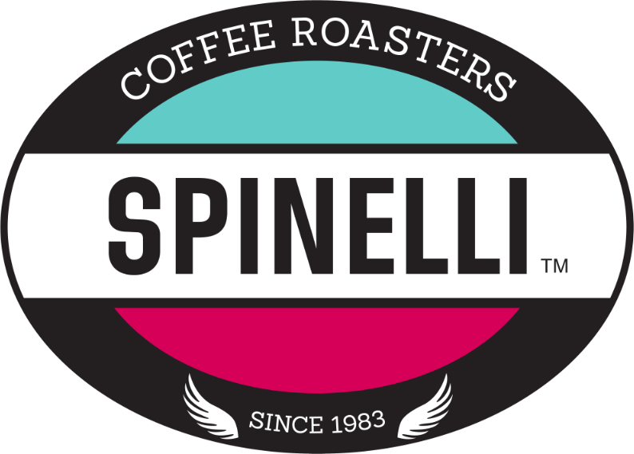 | `/logos/spinelli.png` | inline | `/` | {{text}} | 87.9 KB |
|  | `/logos/stayr.png` | inline | `/` | {{text}} | 639.6 KB |
|  | `/logos/stsignature.png` | inline | `/` | {{text}} | 27.1 KB |
|  | `/logos/Style Palate.png` | inline | `/` | {{text}} | 5.8 KB |
|  | `/logos/subway.png` | inline | `/` | {{text}} | 55.8 KB |
| 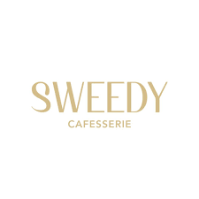 | `/logos/Sweedy.png` | inline | `/` | {{text}} | 3.5 KB |
|  | `/logos/Tash Tish Tosh.png` | inline | `/` | {{text}} | 9.2 KB |
|  | `/logos/Temper Restaurant.png` | inline | `/` | {{text}} | 2.0 KB |
|  | `/logos/tiktok.png` | inline | `/` | {{text}} | 34.1 KB |
|  | `/logos/Toppen Shopping Centre 1.png` | inline | `/` | {{text}} | 13.9 KB |
|  | `/logos/TOPTABLE 1.webp` | inline | `/` | {{text}} | 26.3 KB |
|  | `/logos/wardieres.png` | inline | `/` | {{text}} | 215.8 KB |
|  | `/logos/WATCHSKINS.png` | inline | `/` | {{text}} | 3.3 KB |
|  | `/logos/West Mall 1.png` | inline | `/` | {{text}} | 19.1 KB |
|  | `/logos/Wong Fu Fu.jpeg` | inline | `/` | {{text}} | 14.5 KB |
|  | `/logos/Wu Da Lang Hotpot.jpeg` | inline | `/` | {{text}} | 9.2 KB |
|  | `/logos/Yoru Omakase.jpeg` | inline | `/` | {{text}} | 4.9 KB |
|  | `/logos/Yu Chun Curry Fish.jpeg` | inline | `/` | {{text}} | 300.3 KB |
| 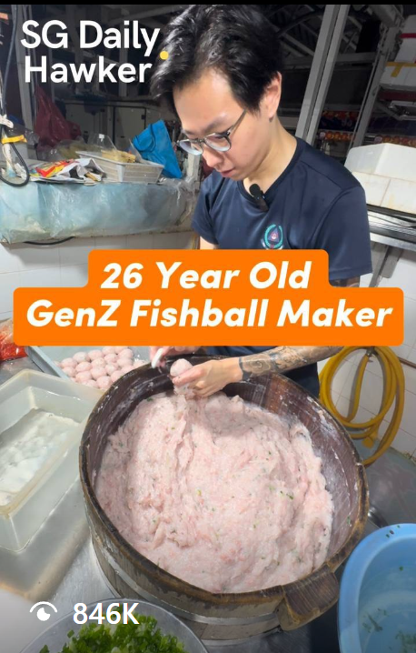 | `/viral-posts/food/26yrfishball.png` | inline | `/` | 26yrfishball | 797.8 KB |
|  | `/viral-posts/food/bistro.png` | inline | `/` | bistro | 666.6 KB |
| 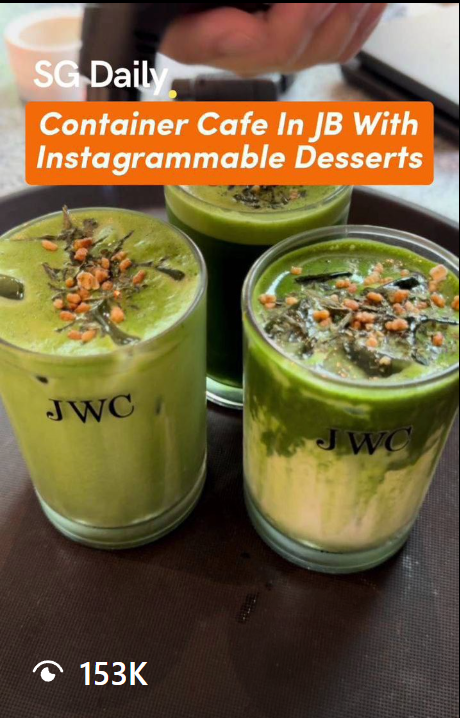 | `/viral-posts/food/containercafe.png` | inline | `/` | containercafe | 781.1 KB |
| 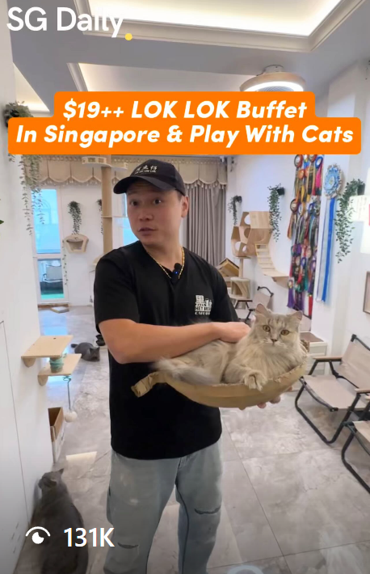 | `/viral-posts/food/loklok.png` | inline | `/` | loklok | 615.6 KB |
| 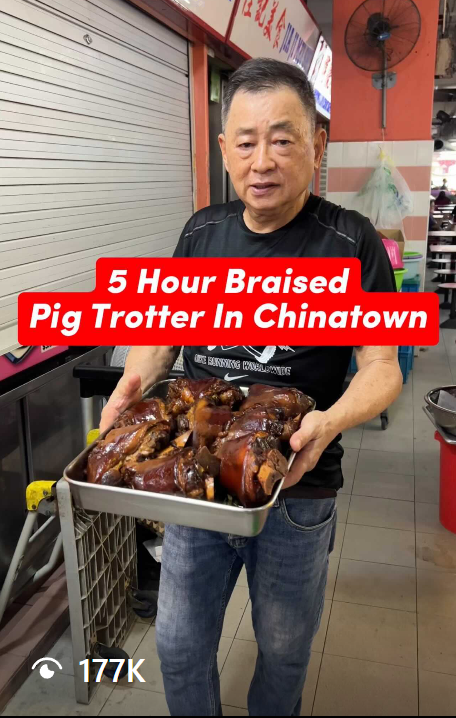 | `/viral-posts/food/pigtrotter.png` | inline | `/` | pigtrotter | 638.2 KB |
|  | `/viral-posts/food/Screenshot 2024-10-11 at 10.05.56 PM.png` | inline | `/` | Screenshot 2024-10-11 at 10.05.56 PM | 769.6 KB |
|  | `/viral-posts/food/Screenshot 2024-10-11 at 10.06.08 PM.png` | inline | `/` | Screenshot 2024-10-11 at 10.06.08 PM | 759.8 KB |
|  | `/viral-posts/food/Screenshot 2024-10-11 at 10.08.17 PM.png` | inline | `/` | Screenshot 2024-10-11 at 10.08.17 PM | 423.2 KB |
| 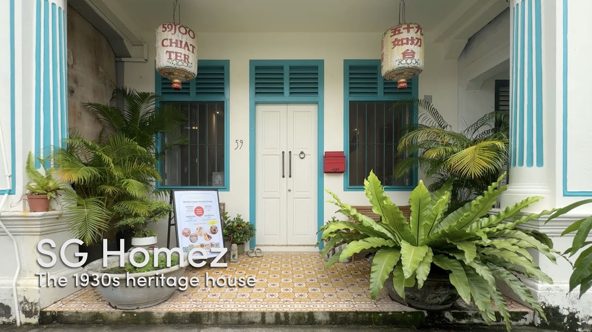 | `/viral-posts/horizontal/59JCT.jpg` | inline | `/` | horizontal video | 162.4 KB |
| 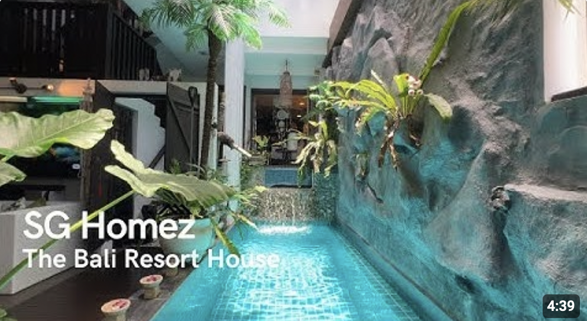 | `/viral-posts/horizontal/bali.png` | inline | `/` | horizontal video | 1.1 MB |
| 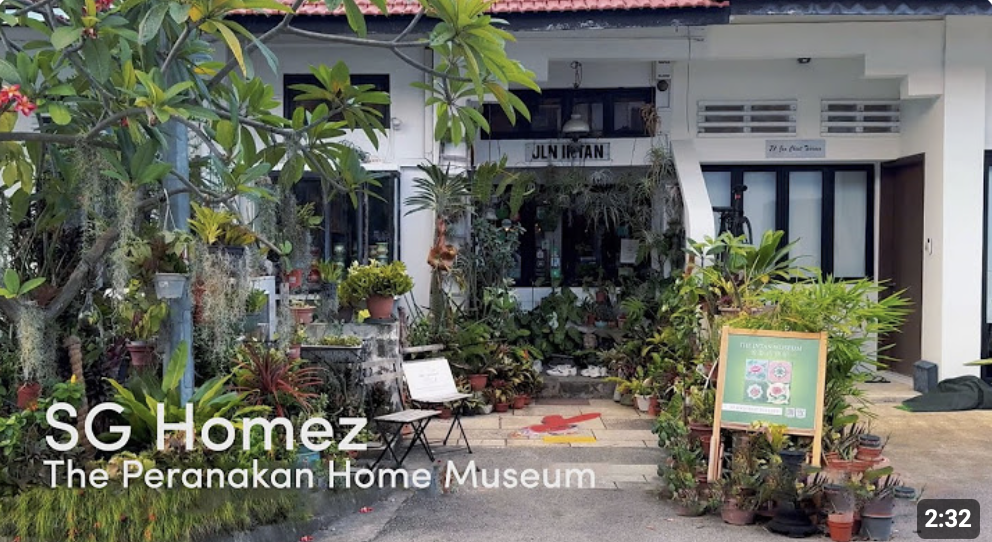 | `/viral-posts/horizontal/intan.png` | inline | `/` | horizontal video | 1.1 MB |
| 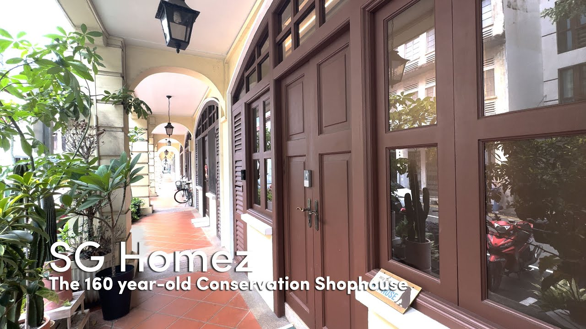 | `/viral-posts/horizontal/shophouse160.jpg` | inline | `/` | horizontal video | 182.9 KB |
|  | `/viral-posts/property/Screenshot 2024-10-11 at 10.39.04 PM.png` | inline | `/` | Screenshot 2024-10-11 at 10.39.04 PM | 577.4 KB |
|  | `/viral-posts/property/Screenshot 2024-10-11 at 10.39.19 PM.png` | inline | `/` | Screenshot 2024-10-11 at 10.39.19 PM | 796.7 KB |
|  | `/viral-posts/property/Screenshot 2024-10-11 at 10.39.48 PM.png` | inline | `/` | Screenshot 2024-10-11 at 10.39.48 PM | 775.2 KB |
|  | `/viral-posts/property/Screenshot 2024-10-11 at 10.41.01 PM.png` | inline | `/` | Screenshot 2024-10-11 at 10.41.01 PM | 617.5 KB |
|  | `/viral-posts/property/Screenshot 2024-10-11 at 10.41.13 PM.png` | inline | `/` | Screenshot 2024-10-11 at 10.41.13 PM | 590.7 KB |
| 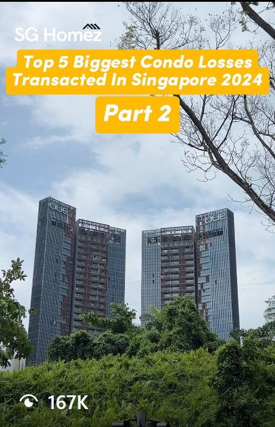 | `/viral-posts/property/Screenshot_1.png` | inline | `/` | Screenshot_1 | 687.7 KB |
| 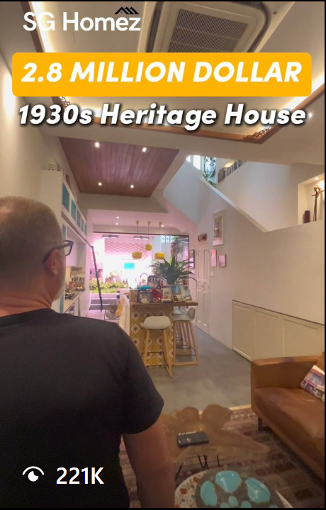 | `/viral-posts/property/Screenshot_2.png` | inline | `/` | Screenshot_2 | 638.3 KB |
| 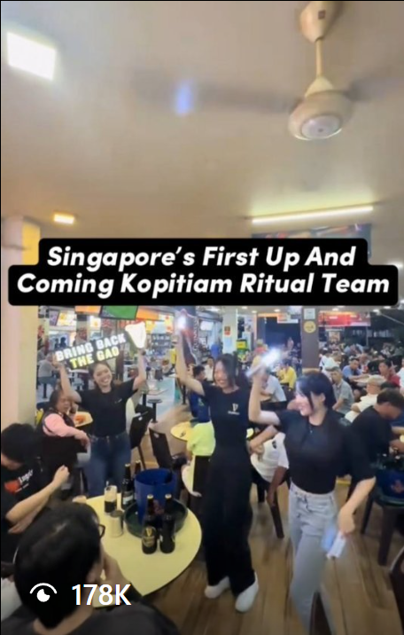 | `/viral-posts/things_to_do/ritual_team.png` | inline | `/` | ritual_team | 632.7 KB |
|  | `/viral-posts/things_to_do/Screenshot 2024-10-11 at 10.15.19 PM.png` | inline | `/` | Screenshot 2024-10-11 at 10.15.19 PM | 613.8 KB |
|  | `/viral-posts/things_to_do/Screenshot 2024-10-11 at 10.15.35 PM.png` | inline | `/` | Screenshot 2024-10-11 at 10.15.35 PM | 676.7 KB |
|  | `/viral-posts/things_to_do/Screenshot 2024-10-11 at 10.17.11 PM.png` | inline | `/` | Screenshot 2024-10-11 at 10.17.11 PM | 675.7 KB |
|  | `/viral-posts/things_to_do/Screenshot 2024-10-11 at 10.18.24 PM.png` | inline | `/` | Screenshot 2024-10-11 at 10.18.24 PM | 674.1 KB |
|  | `/viral-posts/things_to_do/Screenshot 2024-10-11 at 10.18.36 PM.png` | inline | `/` | Screenshot 2024-10-11 at 10.18.36 PM | 582.5 KB |
|  | `/viral-posts/things_to_do/Screenshot 2024-10-11 at 10.28.21 PM.png` | inline | `/` | Screenshot 2024-10-11 at 10.28.21 PM | 620.8 KB |
|  | `/viral-posts/things_to_do/Screenshot 2024-10-11 at 10.28.32 PM.png` | inline | `/` | Screenshot 2024-10-11 at 10.28.32 PM | 664.3 KB |
| 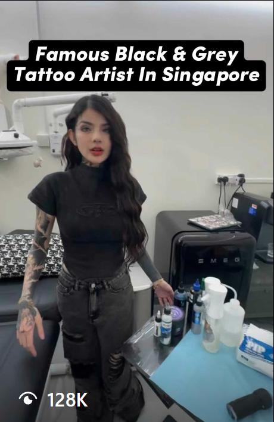 | `/viral-posts/things_to_do/tattoo.png` | inline | `/` | tattoo | 381.1 KB |
|  | `https://cdn.sanity.io/images/3an9f3n5/production/3e8535c8f0b1c53093f97aa52b972ad0d34639c5-2000x2000.png` | inline | `/blog/image-testing-page` | image testing page testing 12:58 | external |
|  | `https://cdn.sanity.io/images/3an9f3n5/production/3e8535c8f0b1c53093f97aa52b972ad0d34639c5-2000x2000.png?w=800` | inline | `/blog` | image testing page testing 12:58 | external |
|  | `https://cdn.sanity.io/images/3an9f3n5/production/7d545b8e7b1154331a1fa19240317a5945ae822d-460x718.png` | inline | `/blog/container-cafes-in-johor-bahru` | Container Cafes in Johor Bahru | external |
|  | `https://cdn.sanity.io/images/3an9f3n5/production/7d545b8e7b1154331a1fa19240317a5945ae822d-460x718.png?w=800` | inline | `/blog` | Container Cafes in Johor Bahru | external |
|  | `https://cdn.sanity.io/images/3an9f3n5/production/80238993d009c51caa2e918d76202d7b5260ce0b-456x718.png` | inline | `/blog/savoring-the-best-pork-trotter-in-chinatown-singapore` | Savoring the Best Pork Trotter in Chinatown, Singapore | external |
|  | `https://cdn.sanity.io/images/3an9f3n5/production/80238993d009c51caa2e918d76202d7b5260ce0b-456x718.png?w=800` | inline | `/blog` | Savoring the Best Pork Trotter in Chinatown, Singapore | external |
|  | `https://cdn.sanity.io/images/3an9f3n5/production/b50c89bd007db9ad068ab740b571bf3fa4d3ee73-458x710.png` | inline | `/blog/sgd19-lok-lok-buffet-in-singapore-the-ultimate-late-night-feast` | $19 Lok Lok Buffet in Singapore: The Ultimate Late-Night Feast! | external |
|  | `https://cdn.sanity.io/images/3an9f3n5/production/b50c89bd007db9ad068ab740b571bf3fa4d3ee73-458x710.png?w=800` | inline | `/blog` | $19 Lok Lok Buffet in Singapore: The Ultimate Late-Night Feast! | external |
